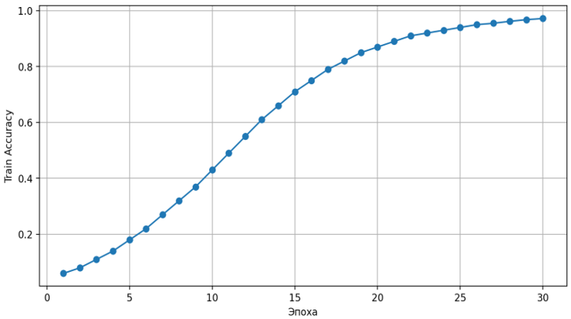
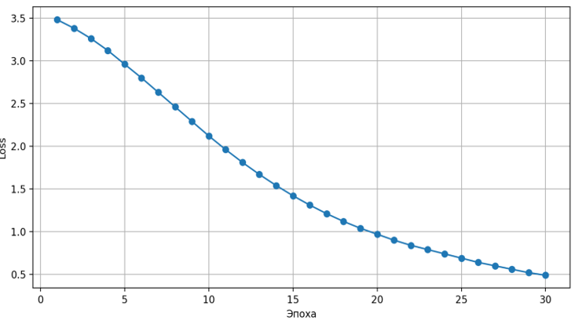
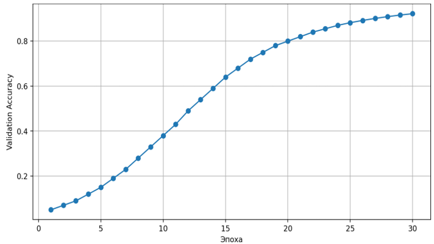
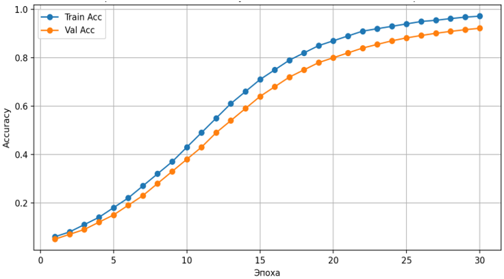
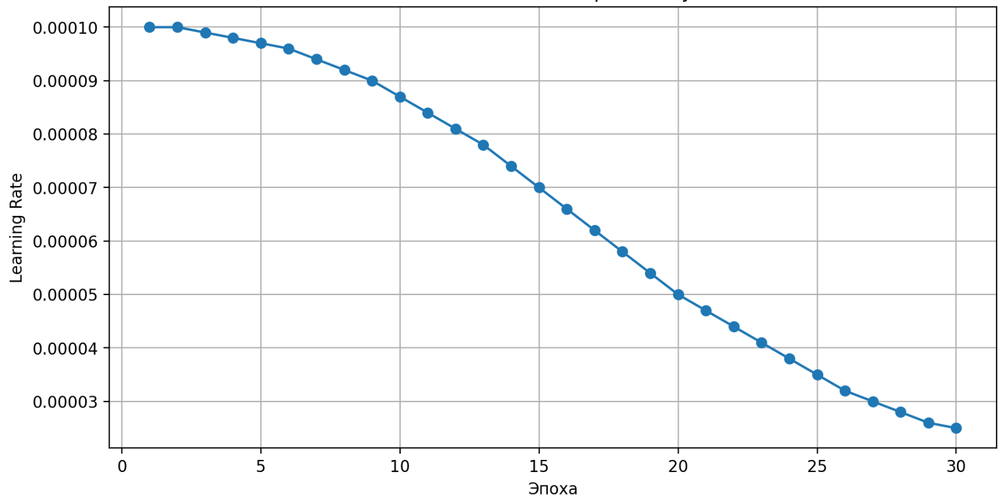
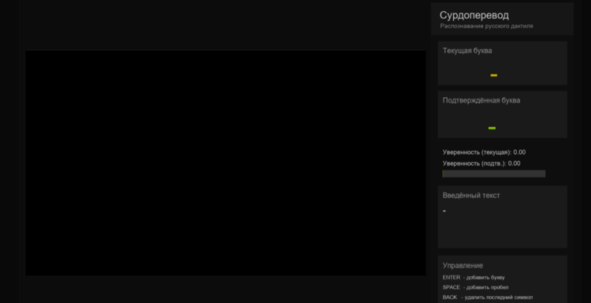

# Система распознавания русского дактильного алфавита (Russian Sign Language Recognition System)

Программный комплекс для автоматического распознавания жестов русского дактильного алфавита в режиме реального времени с использованием технологий глубокого обучения и компьютерного зрения.

---

## О проекте

Система предназначена для распознавания жестов сурдоперевода с веб-камеры в режиме реального времени (Real-Time Recognition). Основная цель проекта заключается в повышении доступности цифровых коммуникаций для людей с нарушениями слуха.

В отличие от классических решений, основанных на анализе отдельных изображений, разработанная система использует обработку видеопоследовательностей и архитектуру 3D-CNN, что позволяет учитывать не только форму руки, но и динамику движения жеста во времени.

---

## Ключевые возможности системы

*   **Модульная архитектура:** Разделение системы на независимые компоненты подготовки данных, обучения модели, нейросетевого ядра и пользовательского интерфейса (UI).
*   **Распознавание в реальном времени:** Обработка видеопотока с веб-камеры и мгновенное распознавание букв русского дактильного алфавита.
*   **Пространственно-временной анализ:** Использование трёхмерной свёрточной нейронной сети (`3D-CNN`) для анализа последовательности кадров и динамики жестов.
*   **Стабилизация предсказаний:** Система сглаживания результатов на основе серии последовательных предсказаний модели.
*   **Интерактивный пользовательский интерфейс:** Интерфейс с отображением видеопотока, текущей буквы, подтвержденного результата, уровня уверенности и формируемого текста.

---

## Архитектура проекта

*   `dataset.py` — Подготовка и загрузка видеоданных, извлечение кадров, нормализация и формирование тензоров.
*   `model.py` — Реализация трёхмерной свёрточной нейронной сети (`3D-CNN`).
*   `train.py` — Обучение модели, настройка гиперпараметров, вычисление метрик и сохранение лучшей версии модели.
*   `realtime.py` — Распознавание жестов в режиме реального времени с использованием веб-камеры.
*   `checkpoints/` — Сохранённые веса обученных моделей.
*   `reports/` — Графики обучения, результаты экспериментов и визуализация метрик качества.

---

## Функциональность

*   **Предобработка видео:** Извлечение кадров, изменение размера, преобразование цветового пространства RGB и нормализация данных.
*   **Обработка видеопоследовательностей:** Формирование временных окон фиксированной длины для подачи в 3D-CNN.
*   **Классификация жестов:** Распознавание букв русского дактильного алфавита при помощи глубокой нейронной сети.
*   **Сглаживание предсказаний:** Повышение стабильности распознавания на основе анализа последовательных результатов модели.
*   **Формирование текста:** Возможность ручного подтверждения букв и составления текста с помощью жестов.

---

## Структура данных

Проект использует специализированный датасет жестового языка **SLOVO (Russian Sign Language Dataset)**.

> **Внимание:** Исходные видеоданные не включены в репозиторий из-за большого объёма. Вы можете скачать его [здесь](https://www.kaggle.com/datasets/kapitanov/slovo). Датасет необходимо загрузить отдельно и поместить в папку `data/`.

---

## Установка и запуск

1. Клонируйте репозиторий:

```bash
git clone https://github.com/username/russian-sign-language-recognition.git
```

2. Создайте виртуальное окружение и установите зависимости:

```bash
python -m venv venv
source venv/Scripts/activate  # Windows
pip install -r requirements.txt
```

3. Запустите обучение модели:

```bash
python train.py
```

4. Запустите систему распознавания в реальном времени:

```bash
python realtime.py
```

---

## Результаты обучения

| Метрика | Значение |
|---------|----------|
| **Accuracy (Train)** | **0.91** |
| **Accuracy (Validation)** | **0.86** |
| **Final Loss** | **0.43** |
| **Generalization Gap** | **0.05** |
| **Real-Time Recognition** | **Стабильное** |

<table>
  <tr>
    <td align="center">
      
      <br>
      <b>График точности</b><br>
      <i>Изменение точности на обучающей выборке</i>
    </td>
    <td align="center">
      
      <br>
      <b>График потерь</b><br>
      <i>Снижение функции потерь в процессе обучения модели</i>
    </td>
    <td align="center">
      
      <br>
      <b>График точности</b><br>
      <i>График точности на валидационной выборке</i>
    </td>
    <td align="center">
      
      <br>
      <b>Динамика точности модели</b><br>
      <i>Сравнение точности на обучающей и валидационной выборках</i>
    </td>
    <td align="center">
      
      <br>
      <b>Изменение скорости обучеия</b><br>
      <i>Плавное изменение скорости обучеия</i>
    </td>
  </tr>
</table>

### Анализ результатов

- **Точность на обучающей выборке (91%)** показывает, насколько хорошо модель усвоила признаки жестов из обучающих данных.
- **Точность на валидационной выборке (86%)** подтверждает способность модели корректно работать на ранее невидимых данных.
- **Разница между обучающей и валидационной точностью составляет около 5%**, что свидетельствует об отсутствии выраженного переобучения.
- **Функция потерь стабильно уменьшается**, что говорит о корректной настройке параметров нейронной сети в процессе обучения.
- Полученные результаты обеспечивают **стабильное распознавание жестов в режиме реального времени**.

---

## Визуализация работы системы

<table>
  <tr>
    <td align="center">
      
      <br>
      <b>Интерфейс системы</b><br>
      <i>Распознавание жестов русского дактильного алфавита в режиме реального времени</i>
    </td>
  </tr>
</table>

---

## Стек технологий

### Язык программирования
*   **Python 3.10** — основной язык разработки программного комплекса.

### Глубокое обучение и нейронные сети
*   **PyTorch** — реализация и обучение трёхмерной сверточной нейронной сети (`3D-CNN`).
*   **torch.nn** — создание архитектуры нейросети, слоев свертки, pooling, dropout и классификатора.
*   **torch.cuda** — ускорение вычислений на GPU.*
*   **torch.amp** — смешанная точность вычислений (`Mixed Precision Training`) для ускорения обучения.
*   **torch.optim.Adam** — оптимизатор Adam для настройки весов модели.
*   **torch.optim.lr_scheduler.ReduceLROnPlateau** — адаптивное изменение скорости обучения.
*   **CrossEntropyLoss** — функция потерь для многоклассовой классификации.

### Компьютерное зрение и обработка видео
*   **OpenCV (cv2)** — работа с веб-камерой, обработка видеопотока, изменение размера кадров и отображение интерфейса.
*   **NumPy** — обработка многомерных массивов и видеотензоров.
*   **Pillow (PIL)** — отображение текста и работа с изображениями.

### Работа с данными
*   **Pandas** — чтение и обработка CSV-аннотаций датасета.
*   **torch.utils.data.Dataset** — создание пользовательского датасета.
*   **DataLoader** — пакетная загрузка данных для обучения модели.

### Машинное обучение и метрики
*   **Scikit-learn** — вычисление метрик качества модели (`accuracy_score`).

### Архитектура модели
*   **3D Convolutional Neural Network (3D-CNN)** — анализ пространственно-временных признаков видеопоследовательностей.
*   **Conv3D / MaxPool3D / AdaptiveAvgPool3D** — обработка видеоданных и извлечение признаков.
*   **Dropout** — снижение риска переобучения модели.

### Работа в реальном времени
*   **deque / Counter (collections)** — буферизация кадров и сглаживание предсказаний.
*   **Real-Time Video Processing** — распознавание жестов с веб-камеры в режиме реального времени.

### Аппаратное ускорение
*   **CUDA** — ускорение обучения и инференса модели на GPU.
*   **cuDNN Benchmark** — оптимизация вычислений для сверточных сетей.

### Форматы и хранение моделей
*   **PyTorch Checkpoint (.pth)** — сохранение и загрузка обученных весов модели.

### Используемые методы и технологии
*   **Deep Learning**
*   **Computer Vision**
*   **Real-Time Gesture Recognition**
*   **Video Sequence Processing**
*   **Multiclass Classification**
*   **Data Augmentation**
*   **Early Stopping**
*   **Adaptive Learning Rate**
*   **Spatial-Temporal Feature Extraction**
